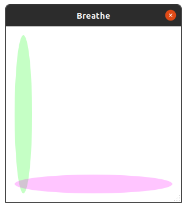

## Note: currently only tried on Ubuntu, will check for windows later..

# BreatheSync
Sync your breaths with shapes in the app.

As we are aware that deep breathing has many advantages, However we often forget to do this in daily life.
I try to take deep breaths whenever possible and start it a lot of times while working but always forget to maintain it after few minutes. Hence I've developed this app that creates transluscent shapes on screen which increase and decrease in size based on the timings you set. This serves to act as a reminder to keep taking deep breaths.

The idea behind this app is: There will be four shapes corresponding to the four modes of breathing- Inhale, Hold In, Exhale, Hold Out.
Each mode will be represented by a shape - Circle in the given example and a colour.  
When you start the app, till the Circle corresponding to Inhale is growing, breathe in.  
When the circle corresponding to Hold In is growing, Hold your breath.  
When the circle corresponding to Exhale (i.e. same as Inhale, can be diff color if you choose), shrinks, you can exhale.  
When the circle corresponding to Hold Out (i.e. same as Hold In, can be diff color if you choose), shrinks, you can hold your breath out.  

It may take some time to get used to this breathing way, However the code is open source, so you are welcome to do any customizations according to your taste.  

## Use

* Start the Application  
   * It will check if a config file exists.
   * If not, one will be created with default values (~/.config/Breather.conf)  

* You will see a window with transluscent shapes increasing and decreasing.
   * You can move this window around by dragging it or resize it by dragging the small corner on the bottom right.  

* Changing configs:  
   * Double click on anywhere on the window and the title bar will appear.
   * Now Right click anywhere in the window to open the dialog box for settings  

* You will have the following options in the dialong box now -  
   * Time for each shape
   * Shapes - Currently available Ellipse, Circle, Rectangle  
   * Position of shape  
   * Direction of shape size change - i.e. Horizontal / Vertical  
   * Color for each shape
   * Shape transluscency
   * Window transluscency

# Screenshots

## Start Window
Please find below the first window that shows up when you launch the app
You can only move this window around and resize it. This translucent window is whats supposed to be on screen while working  
  

## Double click - Configurable mode
Below you can see the window got a title bar now, which you can use to close the window
Right click to open the dialog box for changing settings
  

## Settings change -
Please find below screenshot of the window where you change the settings
  
* Position change - Use the radio buttons position to set where you want your shape
* Shape select - There are three options currently - chose the radio button to select any one
* Direction select - Select the direction where shape will change i.e. increase or decrease sizes
* Size select - Select the size of the shape from 0 - 100 % scale. 0 is shape non existent, and 100 being whole window in the selected direction
* Time - Enter how many seconds the shape should change for

## More screenshots
Please find below the start of a cycle when both the shapes are very small. The Inhale shape will get bigger now, signaling that you can start inhaling.  
  

Below you can see the Inhale shape is full size and Hold In shape is getting bigger, signaling to hold in the breath now.   
  

Below you can see both the shapes are at full size and the Exhale shape will start decreasing now. Please start exhaling now.  
  

Below you can see the Exhale shape is minimum size now and Hold Out shape is decreasing. Please stop exhaling and hold your breath out for this duration.  
  

The cyle will reset after the hold out shape becomes minimum in size - then you start breathing with the increasing inhale shape and so on..  

